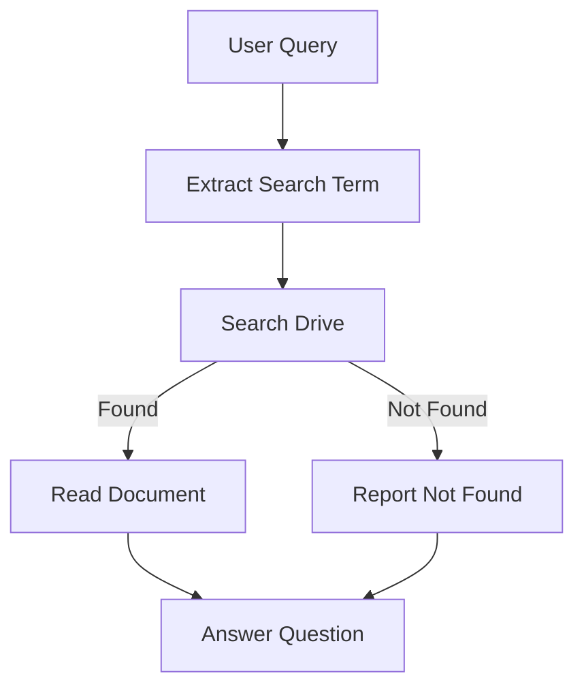

# Design Doc: RAG Chatbot Agent for Google Drive

> Please DON'T remove notes for AI

## Requirements

> Notes for AI: Keep it simple and clear.
> If the requirements are abstract, write concrete user stories

1.  **User**: I want to chat with an AI about documents stored in my Google Drive.
2.  **User**: I want to search for files by name initially, then have the AI read them and answer my questions based on their content.
3.  **User**: The system should use Google Gemini as the LLM.
4.  **User**: I want to interact with the system via a Streamlit web interface.
5.  **User**: The AI must answer in my language (Vietnamese).
6.  **User**: The system should support PDF, Google Docs, and Text files.

## Flow Design

> Notes for AI:
> 1. Consider the design patterns of agent, map-reduce, rag, and workflow. Apply them if they fit.
> 2. Present a concise, high-level description of the workflow.

### Applicable Design Pattern:

**Agentic RAG**: The system acts as an agent that decides which file to retrieve based on the user's query, fetches it, and then uses RAG (Retrieval Augmented Generation) to answer.

### Flow high-level Design:

1.  **ExtractSearchTermNode**: Analyzes the user's query (e.g., "What does the annual report say?") to extract the file name or search term (e.g., "annual report").
2.  **SearchDriveNode**: Uses the extracted term to search Google Drive and returns a list of matching files.
3.  **ReadDocumentNode**: Downloads and extracts text from the most relevant file (or asks for clarification if ambiguous - for now, we'll pick the first/best match).
4.  **AnswerNode**: Generates the final answer using the extracted text as context.



## Utility Functions

> Notes for AI:
> 1. Understand the utility function definition thoroughly by reviewing the doc.
> 2. Include only the necessary utility functions, based on nodes in the flow.

1.  **Call Gemini** (`utils/call_llm.py`)
    -   *Input*: prompt (str)
    -   *Output*: response (str)
    -   Used by ExtractSearchTermNode and AnswerNode.

2.  **Drive Tools** (`utils/drive_tools.py`)
    -   `search_files(query)`: Returns list of files `{id, name, mimeType}`.
    -   `read_file(file_id)`: Downloads and returns text content.
    -   *Necessity*: Core integration for the task.

## Node Design

### Shared Store

> Notes for AI: Try to minimize data redundancy

The shared store structure is organized as follows:

```python
shared = {
    "user_query": "What is in the annual report?",
    "search_term": "annual report",
    "files_found": [{...}],
    "selected_file_content": "Full text of the document...",
    "answer": "The annual report states..."
}
```

### Node Steps

> Notes for AI: Carefully decide whether to use Batch/Async Node/Flow.

1.  **ExtractSearchTermNode**
    -   *Type*: Regular Node
    -   *Prep*: Read `user_query` from shared.
    -   *Exec*: Call LLM to extract keywords for file search.
    -   *Post*: Write `search_term` to shared.

2.  **SearchDriveNode**
    -   *Type*: Regular Node
    -   *Prep*: Read `search_term`.
    -   *Exec*: Call `drive_tools.search_files`.
    -   *Post*: Write `files_found` to shared. If empty, return action "not_found", else "found".

3.  **ReadDocumentNode**
    -   *Type*: Regular Node
    -   *Prep*: Read `files_found`.
    -   *Exec*: Call `drive_tools.read_file` (take the first one for now).
    -   *Post*: Write `selected_file_content` to shared.

4.  **AnswerNode**
    -   *Type*: Regular Node
    -   *Prep*: Read `user_query` and `selected_file_content` (if available).
    -   *Exec*: Call LLM to answer. If no content found, apologize.
    -   *Post*: Write `answer` to shared.
